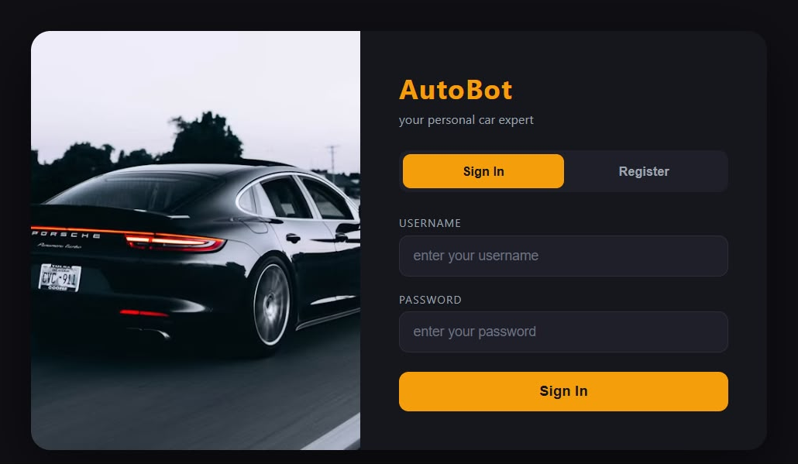
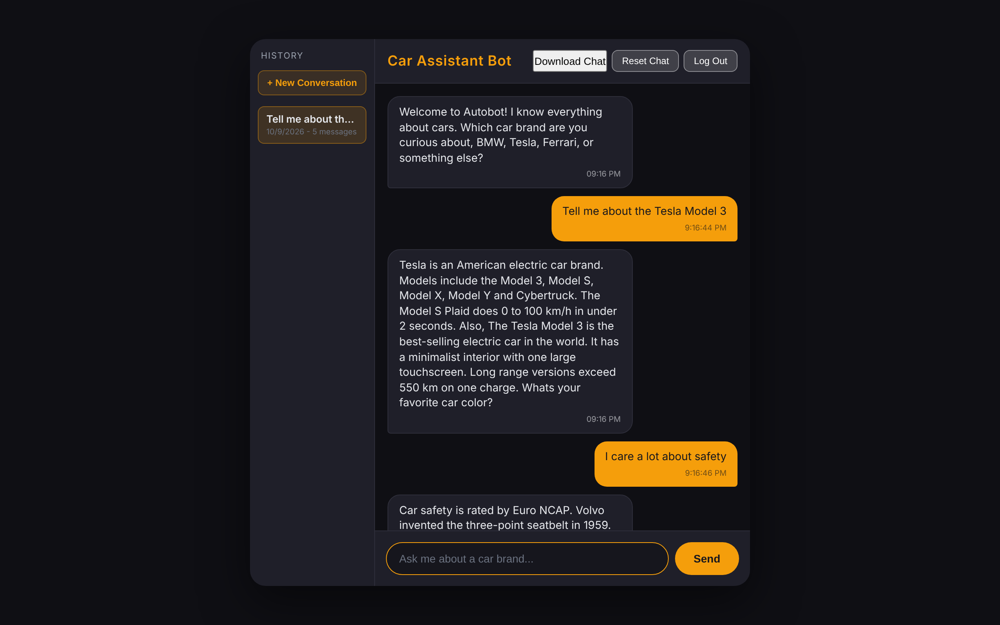
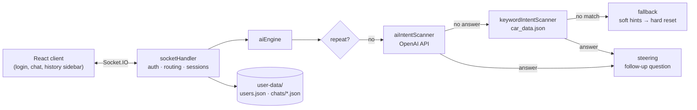

# AutoBot – AI Car Assistant Chatbot

A full-stack, real-time chatbot that answers questions about cars: brands, models, body types, engines, safety and more. It combines an OpenAI-powered engine with a rule-based keyword engine as a fallback, and supports user accounts with saved, multi-conversation chat history.

**Live demo:** [autobot-ewhdcfduedb9bmaz.polandcentral-01.azurewebsites.net](https://autobot-ewhdcfduedb9bmaz.polandcentral-01.azurewebsites.net)
*(Register any username and password to try it. The first load can take a few seconds while the Azure instance wakes up.)*


| Sign in | Chat |
|---|---|
|  |  |

---

## Features

- **AI answers** – free-form questions are answered by OpenAI (`gpt-4o-mini`) with a car-expert system prompt that keeps replies short and on topic.
- **Keyword engine fallback** – if the AI is unavailable, the bot answers from a curated knowledge base of 150+ car keywords (brands, models, body types, topics).
- **Conversation design** – follow-up "steering" questions keep the chat going, repeat detection avoids answering the same question twice, and a soft → hard fallback strategy recovers from confusing input.
- **User accounts** – registration and login with bcrypt-hashed passwords.
- **Saved conversations** – each user can start new chats, reopen older ones from the history sidebar, reset a chat, or download it as JSON.
- **Real-time messaging** over WebSockets (Socket.IO).
- **CI/CD** – built and deployed to Azure App Service by a GitHub Actions pipeline.

## How it works



1. The React client sends each message over a Socket.IO connection.
2. `socketHandler` checks the user's session and passes the text to `aiEngine`.
3. `aiEngine` skips repeated questions, asks OpenAI for an answer, and falls back to the keyword knowledge base if needed.
4. A steering question is appended to keep the conversation going, and the updated chat is saved to the user's history file.

The project started with a purely rule-based keyword engine (`keywordEngine.js`), which was later replaced by the AI engine. The keyword engine's knowledge base is still used as the fallback.

## Project structure

```
autobot-car-assistant/
├── server/
│   ├── server.js                 # Express + Socket.IO server, serves the React build
│   ├── socketHandler.js          # auth, message routing, conversation sessions
│   ├── engine/
│   │   ├── aiEngine.js           # main conversation engine (AI → keywords → fallback)
│   │   ├── aiIntentScanner.js    # OpenAI chat completion call
│   │   ├── keywordEngine.js      # original rule-based engine (v1)
│   │   ├── keywordIntentScanner.js
│   │   ├── steering.js           # follow-up questions
│   │   ├── fallback.js           # soft / hard fallback strategy
│   │   ├── repeatGuard.js        # repeat detection
│   │   └── historyHandler.js     # in-memory conversation history
│   ├── storage/
│   │   ├── userAccounts.js       # signup / login with bcrypt
│   │   ├── savedChats.js         # per-user saved conversations
│   │   └── dataDir.js            # runtime data location
│   └── data/
│       └── car_data.json         # keyword knowledge base
├── frontend/                     # React app (Create React App)
│   ├── public/
│   └── src/
├── docs/screenshots/
├── .env.example
└── package.json
```

## Run it locally

**Requirements:** Node.js 18 or newer.

```bash
git clone https://github.com/YasinVersiani/autobot-car-assistant.git
cd autobot-car-assistant

npm install          # server dependencies
npm run build        # installs and builds the React frontend

cp .env.example .env # then add your OpenAI API key
npm start
```

Open [http://localhost:3000](http://localhost:3000), register an account and start chatting.

The OpenAI key is optional: without it, the bot answers from the keyword knowledge base.

| Variable | Description | Default |
|---|---|---|
| `OPENAI_API_KEY` | OpenAI API key for the AI engine | – (keyword engine only) |
| `OPENAI_MODEL` | Chat model to use | `gpt-4o-mini` |
| `PORT` | HTTP port | `3000` |
| `DATA_DIR` | Folder for user accounts and saved chats | `./user-data` |

## Deployment

The live demo runs on **Azure App Service** (Node.js). A **GitHub Actions** workflow builds and deploys it on every push to `main` (reference copy: [`docs/deployment/azure-webapp.yml`](docs/deployment/azure-webapp.yml)):

1. Install server dependencies and build the React frontend.
2. Package the app, leaving out frontend sources and `node_modules`.
3. Log in to Azure with OpenID Connect (no stored credentials) and deploy with `azure/webapps-deploy`.

The OpenAI key is provided through environment variables and is never committed to the repository.

## Tech stack

**Backend:** Node.js, Express, Socket.IO, bcryptjs, dotenv
**Frontend:** React 18, socket.io-client, CSS (dark theme, responsive)
**AI:** OpenAI Chat Completions API
**Infrastructure:** Azure App Service, GitHub Actions

## Author

**Yasin Versiani** – [GitHub](https://github.com/YasinVersiani)
